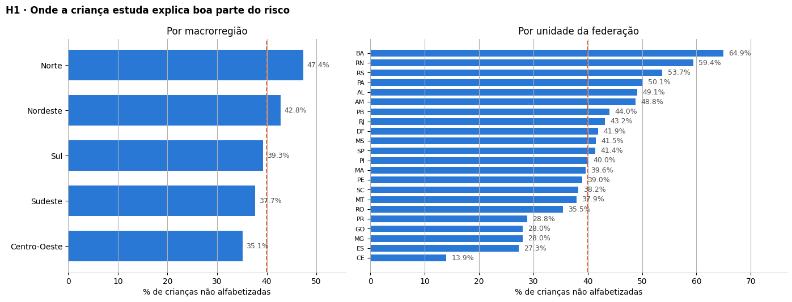
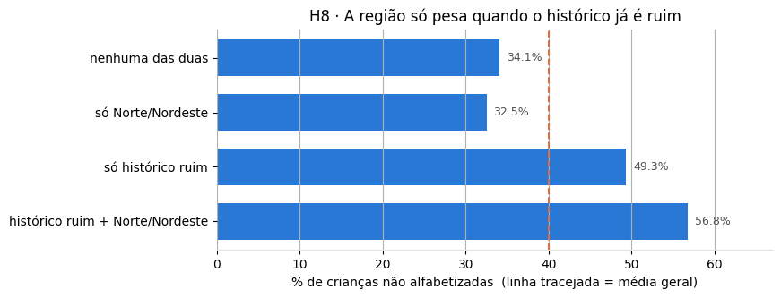
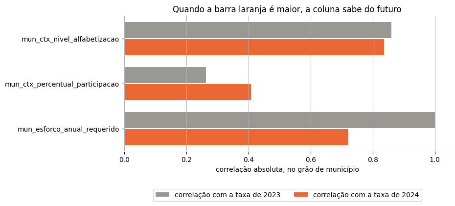
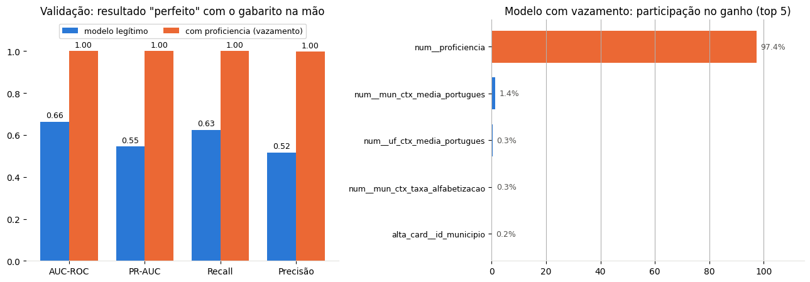
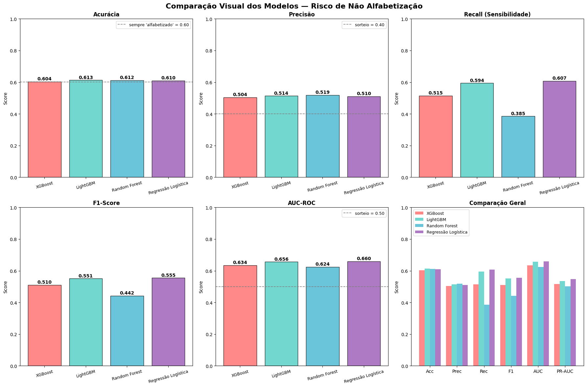
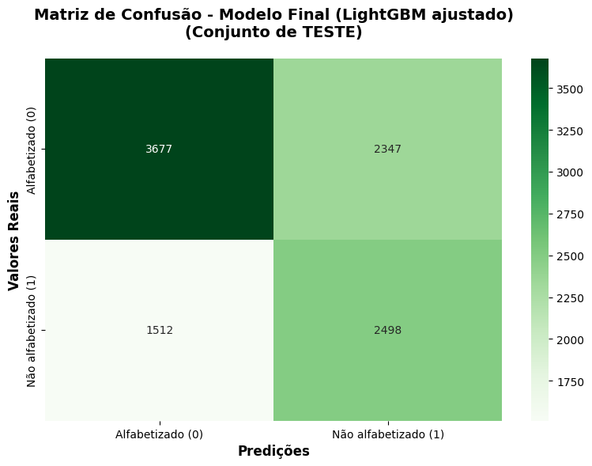
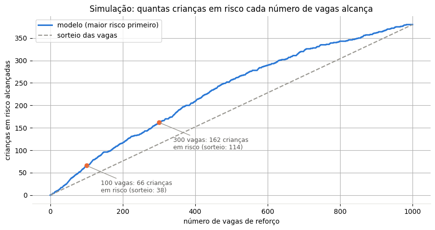
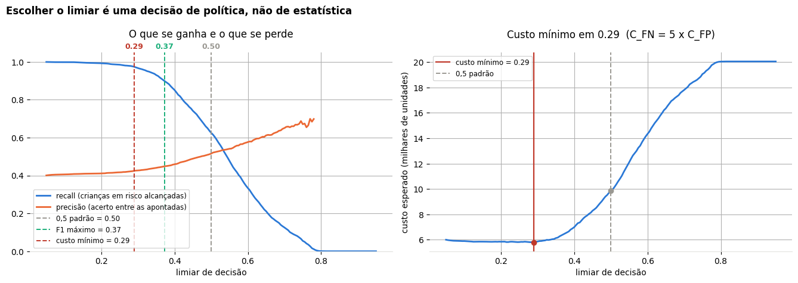
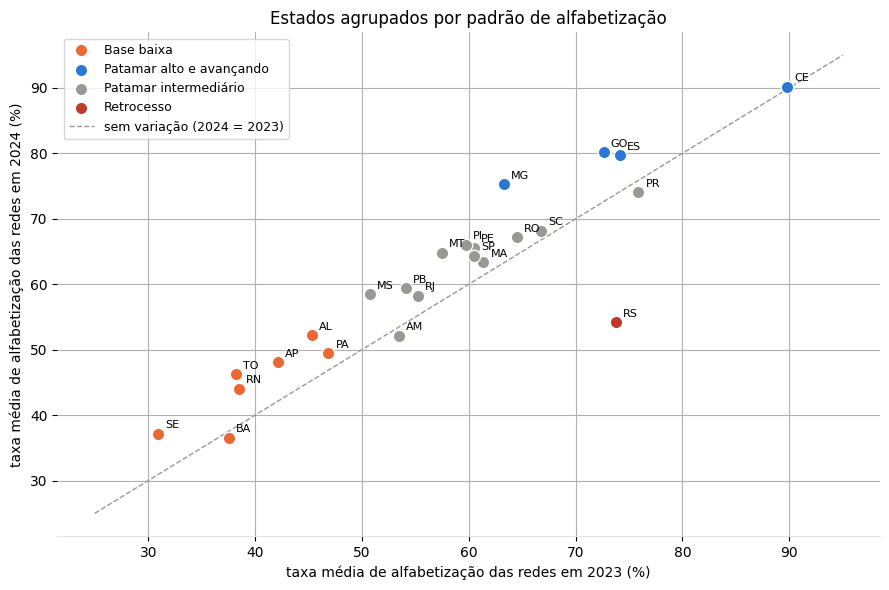
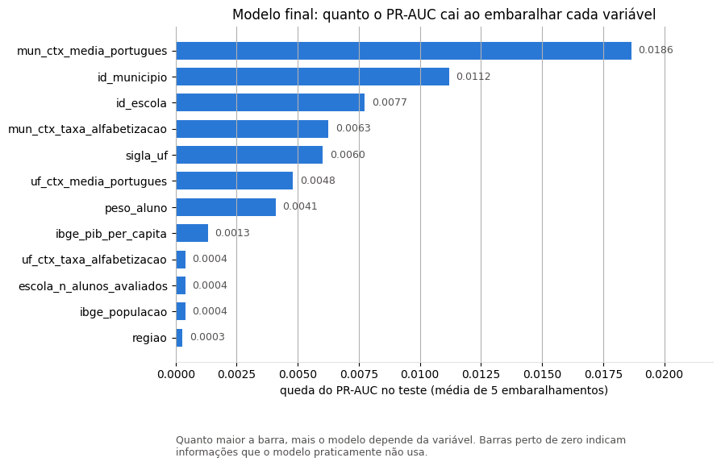

# 🎯 Predição do Risco de Não Alfabetização no Brasil

**Tech Challenge — Fase 3 · Pós-Tech FIAP (AI Scientist)**

Modelagem supervisionada sobre a camada **Gold** do *Indicador Criança Alfabetizada* (INEP, via
[Base dos Dados](https://basedosdados.org/dataset/073a39d4-89cf-4068-b1e8-34ed0d9c0b72)), enriquecida com indicadores
socioeconômicos da API do IBGE. Todo o trabalho segue o ciclo **CRISP-DM**, explicado em linguagem acessível no notebook
[`notebooks/projeto_alfabetizacao.ipynb`](notebooks/projeto_alfabetizacao.ipynb).

**1.851.852 alunos · 5.517 municípios · 42.328 escolas · 26 UFs** (base completa) — análise feita sobre uma amostra reprodutível de **50.169 crianças**.

| Destaques | |
|---|---|
| **Modelo final** | LightGBM ajustado (Random Search, 50 combinações × 5 dobras) |
| **Desempenho no teste** (10.034 crianças nunca vistas) | AUC-ROC **0,667** · PR-AUC **0,551** (sorteio = 0,40) · recall **62,3%** · precisão **51,6%** |
| **Crianças novas** (simulação com 1.000) | acurácia **63,8%** · recall **65,5%** |
| **Priorização com 100 vagas de reforço** | **66** crianças em risco alcançadas, contra **38** num sorteio (**1,74x**) |
| **Modelo de risco municipal** | AUC-ROC **0,861** · PR-AUC **0,840** |

---

## Sumário

1. [Contexto do problema](#1-contexto-do-problema)
2. [Objetivo analítico](#2-objetivo-analítico)
3. [Base utilizada](#3-base-utilizada)
4. [Estrutura do projeto](#4-estrutura-do-projeto)
5. [Como executar](#5-como-executar)
6. [Etapas do projeto (CRISP-DM)](#6-etapas-do-projeto-crisp-dm)
7. [Resumo das hipóteses](#7-resumo-das-hipóteses)
8. [Verificação de vazamento](#8-verificação-de-vazamento)
9. [Escolha das features](#9-escolha-das-features)
10. [Escolha do modelo](#10-escolha-do-modelo)
11. [Performance do modelo](#11-performance-do-modelo)
12. [Respostas às perguntas de negócio](#12-respostas-às-perguntas-de-negócio)
13. [Insights](#13-insights)
14. [Limites](#14-limites)
15. [Próximos passos](#15-próximos-passos)

---

## 1. Contexto do problema

O **Compromisso Nacional Criança Alfabetizada** define uma meta mensurável: toda criança brasileira alfabetizada até o fim do
2º ano do ensino fundamental, até 2030. A régua é o **Indicador Criança Alfabetizada** — o percentual de estudantes que atingem
**743 pontos** na escala Saeb, corte estabelecido pela Pesquisa Alfabetiza Brasil de 2023.

Em 2024, **cerca de 40%** das crianças avaliadas **não** atingiram esse corte. O problema é o momento: a prova acontece no fim do
ano letivo, quando já não dá mais tempo de agir. A Fase 2 deste Tech Challenge entregou a pipeline de dados que consolida o
indicador — mas um número consolidado descreve o passado. Gestores públicos precisam **antecipar**: identificar quem está em
risco enquanto ainda há tempo, e entender quais fatores pesam de fato no resultado.

## 2. Objetivo analítico

Prever se uma criança será **alfabetizada ou não**, usando apenas o que se sabe **antes da prova** — variáveis educacionais,
territoriais e socioeconômicas — e transformar essa capacidade preditiva em **priorização acionável** de política pública.

> **Pergunta de negócio:** com o que já se sabe antes da avaliação — o município, a escola, a rede e o histórico do território
> em 2023 — qual é o risco de uma criança não se alfabetizar em 2024?

O projeto usa **dois modelos**, porque as perguntas do desafio estão em dois níveis:

| Modelo | Grão | Alvo | Para quê | Onde |
|---|---|---|---|---|
| **Por criança** | criança avaliada em 2024 | não alfabetizada (1) | identificar e priorizar crianças em risco | `notebooks/projeto_alfabetizacao.ipynb` |
| **Por município** | (município, rede) | não atingir a meta de 2024 | apontar as redes onde alocar recursos | `src/modeling/train_municipio.py` |

A análise mostrou que os microdados públicos **não trazem atributos individuais** — não há renda familiar, frequência escolar nem
escolaridade dos pais. O modelo por criança, portanto, tem teto baixo por construção: o sinal que existe é **territorial**.

## 3. Base utilizada

A modelagem consome **exclusivamente a camada Gold**, embarcada em `data/gold/` e processada por
`src/preprocessing/build_base.py` em **DuckDB**, lendo os Parquet direto do disco.

| Visão Gold | Grão | Linhas | Origem |
|---|---|---|---|
| `gold_aluno_analitico` | (ano, id_aluno) | 3.354.661 | **Fase 3** |
| `gold_alfabetizacao_municipio` | (ano, município, rede) | 23.995 | Fase 2 |
| `gold_metas_municipio` | (município, rede) | 12.650 | **Fase 3** |
| `gold_alfabetizacao_uf` | (ano, UF) | 49 | Fase 2 |

### De onde sai cada bloco de variáveis

| Bloco | Colunas | Fonte |
|---|---|---|
| Avaliação do aluno | `rede`, `serie`, `caderno`, `peso_aluno` | `gold_aluno_analitico` |
| Território | `sigla_uf`, `regiao`, `id_municipio`, `id_escola` | `gold_aluno_analitico` |
| Contexto municipal **2023** | taxa de alfabetização, média de português | `gold_alfabetizacao_municipio` |
| Metas | `mun_meta_2024`, `mun_gap_projetado` | `gold_metas_municipio` |
| Contexto estadual **2023** | taxa, média de português, ranking nacional | `gold_alfabetizacao_uf` |
| Porte da rede | alunos e escolas avaliados | contagens sobre `gold_aluno_analitico` |
| Socioeconômico | população, PIB per capita, densidade demográfica | API de agregados do IBGE |

**Defasagem temporal:** a criança é de **2024**, mas todo o contexto do município e do estado vem de **2023**. É isso que impede que
um resumo do próprio resultado entre no modelo (ver [Verificação de vazamento](#8-verificação-de-vazamento)).

**Amostra do notebook:** a base completa (1,85 milhão de crianças) é grande demais para versionar e para um notebook didático.
O notebook usa **50.169 crianças** sorteadas de forma **reprodutível** — `hash(id_aluno || 42) % 1.000.000 < 26.999` —, o que garante
que o sorteio refeito devolve sempre as mesmas crianças (40,0% de não alfabetizados, contra 40,2% na base completa).

Proveniência completa: **[`data/gold/PROVENIENCIA.md`](data/gold/PROVENIENCIA.md)** · Esquema e papel de cada coluna:
**[`reports/dicionario_dados.md`](reports/dicionario_dados.md)**.

### Por que a Fase 3 precisou estender a Gold

As visões `gold_alfabetizacao_municipio` e `gold_alfabetizacao_uf` vieram prontas da Fase 2. As outras duas —
`gold_aluno_analitico` e `gold_metas_municipio` — foram publicadas nesta fase, porque a Gold da Fase 2 não preservava o que a
modelagem exige:

- **O grão de aluno não existia na Gold.** A visão `gold_desempenho_alunos` da Fase 2 é agregada por município/rede/série:
  **12.923 linhas para 3,3 milhões de alunos**, sem a coluna `id_aluno`. O alvo pedido pelo enunciado — "este aluno será
  alfabetizado?" — é individual.
- **As metas defasadas não sobreviviam à Gold.** `gold_alfabetizacao_municipio` guarda apenas `meta_ano`, **nula nas 11.547 linhas
  de 2023** — justamente o ano de contexto do desenho anti-vazamento. As colunas `meta_alfabetizacao_2024..2030` tinham ficado na Silver.

A Fase 3 **estende** a camada em vez de furá-la: publica as duas visões que faltavam e toda a modelagem passa a ler **só da Gold**.
Nada do que a Fase 2 entregou foi alterado. Na publicação, apenas registros de `origem = 'batch'` entram — os eventos `streaming`
da Fase 2 são sintéticos, feitos para demonstrar a pipeline — e crianças sem resultado na avaliação ficam de fora.

## 4. Estrutura do projeto

```
📁 Tech_Challenge
├── 📁 data
│   ├── 📁 gold
│   ├── 📁 external
│   └── 📁 processed
├── 📁 notebooks
├── 📁 src
│   ├── 📁 preprocessing
│   ├── 📁 modeling
│   ├── 📁 evaluation
│   └── 📁 visualization
├── 📁 reports
├── 📁 images
├── 📁 models
├── [IAST] - Tech Challenge - Fase 3.pdf
├── requirements.txt
├── README.md
├── .gitignore
└── .gitattributes
```

| Pasta / arquivo | O que contém |
|---|---|
| **`data/gold/`** | As 4 visões da camada Gold (Parquet particionado por ano) e `PROVENIENCIA.md`, com a origem dos dados. Versionada: é o que torna o projeto autossuficiente. |
| **`data/external/ibge_municipios.parquet`** | Cache dos indicadores do IBGE (população, PIB, densidade), baixado automaticamente na primeira execução. |
| `data/processed/base_analitica_alunos_amostra.parquet` | Amostra de 50.169 crianças, versionada — ponto de partida do notebook. |
| `data/processed/base_alfabetizacao_amostra.csv` | A mesma amostra em CSV (separador `;`), gerada pelo notebook. |
| `data/processed/base_simulacao_1000.csv` | 1.000 crianças que o projeto nunca usou, para a simulação da Fase 05. |
| `data/processed/base_analitica_alunos.parquet` · `base_municipal.parquet` | Base completa e base municipal (fora do Git), geradas por `build_base.py`. |
| **`notebooks/projeto_alfabetizacao.ipynb`** | A análise completa: negócio, preparação, modelagem, avaliação, implantação, perguntas de negócio, insights e próximos passos. |
| `src/config.py` | Caminhos, semente (42), recorte temporal e **contrato de colunas** (features, colunas vetadas por vazamento). |
| `src/preprocessing/build_base.py` | Monta a base completa, a amostra e a base municipal a partir da Gold, em DuckDB. |
| `src/preprocessing/ibge.py` | Baixa e guarda em cache os indicadores do IBGE. |
| `src/preprocessing/build_features.py` | Pré-processamento do modelo (`constroi_preprocessador`: mediana + indicador, one-hot, TargetEncoder) e separação X/y (`matriz_xy`). |
| `src/modeling/train_municipio.py` | Treina o modelo de risco municipal e gera o ranking e as métricas em `reports/`. |
| `src/evaluation/metricas.py` | `limiar_otimo_f1`: encontra o limiar de decisão que maximiza o F1. |
| `src/visualization/plots.py` | Paleta e funções de gráfico (`barras_horizontais`, `anota`, `salva`). |
| `reports/dicionario_dados.md` | Dicionário de dados: cada coluna, sua origem e seu papel (feature, identificador, vetada). |
| `reports/municipios_risco.csv` | Ranking das 10.806 redes municipais por probabilidade de não atingir a meta. |
| `reports/metricas_municipio.json` · `importancia_municipio.csv` | Métricas e importância das variáveis do modelo municipal. |
| `reports/comparacao_modelos.csv` | Métricas dos 4 algoritmos na validação (gerada pelo notebook). |
| **`images/`** | As 33 figuras geradas pelo notebook (as principais aparecem neste README). |
| `models/modelo_final_alfabetizacao.joblib` | Modelo final: Pipeline completo (pré-processamento + LightGBM ajustado). |
| `models/modelo_final_alfabetizacao.json` | Ficha do modelo: colunas de entrada, limiares, métricas, hiperparâmetros e avisos de uso. |
| `models/pipeline_municipio.joblib` | Modelo de risco municipal. |
| `[IAST] - Tech Challenge - Fase 3.pdf` | Enunciado do desafio. |
| `requirements.txt` | Dependências com versões fixadas (scikit-learn 1.5.2, LightGBM 4.5.0, XGBoost 3.4.1…). |

## 5. Como executar

```bash
# 1. Criar o ambiente e instalar as dependências (Python 3.12)
python -m venv .venv
.venv\Scripts\activate          # Windows  (Linux/macOS: source .venv/bin/activate)
pip install -r requirements.txt

# 2. Abrir o notebook e executar todas as células (~15 minutos, por causa da busca de hiperparâmetros)
jupyter notebook notebooks/projeto_alfabetizacao.ipynb
```

O notebook roda com a **amostra versionada** — não é preciso nenhum outro passo. Para regenerar os artefatos a partir da Gold:

```bash
python -m src.preprocessing.build_base      # base completa, amostra e base municipal
python -m src.modeling.train_municipio      # modelo municipal, ranking de risco e métricas
```

## 6. Etapas do projeto (CRISP-DM)

| Fase | Etapa | O que foi feito |
|---|---|---|
| **1 · Negócio** | Entendimento | Pergunta de negócio, alvo (`nao_alfabetizado` = 1), métrica (PR-AUC e recall, porque deixar uma criança em risco de fora custa mais que um alarme falso) e o critério anti-vazamento. |
| **2 · Preparação** | Coleta | Origem da base, sorteio reprodutível da amostra e gravação em CSV. |
| | Limpeza | 50.169 crianças × 32 colunas; nulos só no contexto de 2023 (máx. 4,75%, concentrados em DF e AC, que não participaram de 2023) — a ausência é informação, não defeito; outliers mantidos (São Paulo é real); alvo 60/40. |
| | Análise exploratória | 9 hipóteses — 7 individuais e 2 combinadas — testadas com qui-quadrado, V de Cramér, correlação e odds ratio. |
| | Feature engineering | Distância até a meta (`mun_gap_projetado`) e população em log (assimetria 3,24 → 0,41). |
| | Correlações | Nenhuma variável isolada passa de \|0,25\| com o alvo; diagnóstico das colunas que "enxergam" 2024. |
| **3 · Modelagem** | Pré-processamento | Separação treino/validação/teste (60/20/20, estratificada), transformação em Pipeline, oversampling só no treino e seleção de variáveis (Random Forest e informação mútua). |
| | Treinamento | XGBoost, Random Forest, LightGBM e Regressão Logística, comparados na validação. |
| | Ajuste fino | Random Search do LightGBM (50 combinações × 5 dobras, sem cópias do balanceamento). |
| | Limiar e calibração | Escolha do corte de decisão na validação e conferência das probabilidades. |
| | Teste anti-vazamento | O mesmo modelo treinado com a nota da prova, para provar por que ela foi excluída. |
| **4 · Avaliação** | Máquina preditiva | Métricas finais no teste, previsto x observado por UF e importância das variáveis do modelo final. |
| **5 · Implantação** | Modelo e simulação | Modelo salvo com ficha, simulação com 1.000 crianças novas e simulação de vagas para o gestor. |
| **Fechamento** | Negócio | Respostas às 5 perguntas, insights, limites e próximos passos. |

## 7. Resumo das hipóteses

| Hipótese | Descrição | Resultado |
|---|---|---|
| **H1 — Território** | O estado e a região onde a criança estuda influenciam o risco | ✅ **CONFIRMADA** — 13,9% no Ceará e 64,9% na Bahia (51 pontos); V de Cramér da UF 0,228 contra 0,070 da região |
| **H2 — Persistência** | Municípios com taxa baixa em 2023 continuam com resultado ruim em 2024 | ✅ **CONFIRMADA** — correlação de 0,72; risco 3,5x maior no pior decil (58,8% × 16,8%) |
| **H3 — Rede de ensino** | A rede (municipal ou estadual) muda o risco | ⚠️ **CONFIRMADA, MAS FRACA** — 40,2% × 38,6% |
| **H4 — Riqueza** | Municípios mais ricos têm menos crianças não alfabetizadas | ❌ **REJEITADA** — o PIB, sozinho, não mostrou padrão |
| **H5 — Meta de 2024** | Municípios abaixo da meta têm mais risco | ✅ **CONFIRMADA** — 42,2% × 25,4% (OR 2,15) |
| **H6 — Tamanho do município** | O risco aumenta com o tamanho do município | ⚡ **PARCIALMENTE CONFIRMADA** — sobe de 35,3% a 45,6% e cai nas metrópoles (41,9%) |
| **H7 — Escola pequena** | Escolas pequenas têm mais risco | ⚠️ **CONFIRMADA, MAS FRACA** — 42,1% × 39,5% (OR 1,11) |
| **H8 — Histórico ruim + Norte/Nordeste** | As duas condições juntas elevam muito o risco | ✅ **CONFIRMADA** — 56,8%; a região sozinha não pesa (32,5%) |
| **H9 — Município pobre + histórico ruim** | As duas condições juntas elevam muito o risco | ✅ **CONFIRMADA** — 55,2%; a pobreza sozinha não pesa (31,8%) |





## 8. Verificação de vazamento

**Vazamento** (*data leakage*) é quando o modelo recebe, no treino, uma informação que não estaria disponível no momento real da
previsão — em geral, algo que já "entrega" a resposta. O resultado parece ótimo no notebook e falha no mundo real. A verificação foi
feita em **três camadas**:

**1. Por definição.** `proficiencia` é a nota da prova e **é** a resposta (743 pontos ou mais = alfabetizado). Ela e todos os resumos
do resultado de 2024 (taxa e média de português do município no mesmo ano) ficam fora do modelo — lista `COLUNAS_LEAKAGE` em `src/config.py`.

**2. Diagnóstico temporal.** Algumas colunas parecem ser de 2023, mas foram calculadas sem separar o ano. O teste: uma coluna honesta de
2023 deve se parecer **mais com o resultado de 2023** do que com o de 2024. `mun_ctx_percentual_participacao` reprova (correlação 0,408
com 2024 contra 0,263 com 2023) e é vetada, assim como `mun_ctx_nivel_alfabetizacao` (reprova na base completa) e as colunas constantes
(metas de 2030 = 80) — lista `COLUNAS_VETADAS_DIAGNOSTICO`.



**3. Vazamentos de processo.** Mesmo com as colunas certas, o **jeito de treinar** pode vazar informação:

| Risco | Como foi resolvido |
|---|---|
| Preencher vazios e codificar categorias olhando também o teste | Tudo acontece dentro de um **Pipeline**, ajustado **só com o treino** |
| Cópias do oversampling nos dois lados da validação cruzada | A busca de hiperparâmetros usa o **treino original**, com `scale_pos_weight` |
| Código da escola "vendo" a própria resposta (TargetEncoder) | Validação cruzada interna do encoder e pré-processador ajustado **sem as cópias** |
| Escolher o limiar olhando o teste | Limiar escolhido na **validação**; o teste só confere |

**A prova de que funcionou.** O teste anti-vazamento treina o **mesmo modelo** com a nota da prova: o resultado vai a **AUC 1,000** e
recall de 100% — "perfeito" e inútil, porque exigiria já ter a prova. Sem ela, o modelo final tem AUC **0,662** na validação e se mantém
estável em dados cada vez mais novos: acurácia de **61,6%** na validação, **61,5%** no teste e **63,8%** em crianças nunca usadas.



## 9. Escolha das features

**O que entra no modelo: 22 variáveis** — tudo o que se sabe **antes da prova**.

| Tipo | Variáveis | Tratamento |
|---|---|---|
| **15 numéricas** | taxa, média de português e meta do município (2023); taxa, média e ranking do estado (2023); porte da escola e do município; população, PIB e densidade (IBGE); peso amostral | mediana + coluna indicando que faltava dado |
| **5 categóricas curtas** | `rede`, `serie`, `caderno`, `regiao`, `sigla_uf` | one-hot (uma coluna sim/não por valor) |
| **2 de alta cardinalidade** | `id_municipio`, `id_escola` | TargetEncoder (risco médio do lugar, com validação cruzada interna) |

**O que fica fora: 10 colunas** — o alvo; a nota da prova (`proficiencia`); 5 colunas vetadas por vazamento ou constantes; e 3
identificadores (`ano`, `id_aluno`, `nome_municipio`). Depois da transformação, as 22 variáveis viram **81 colunas**.

**Diagnóstico de relevância.** Random Forest e informação mútua concordaram que o **lugar onde a criança estuda** e o **histórico de 2023**
carregam a maior parte da informação — mas cada método tem um viés (o Random Forest favorece variáveis com muitos valores; a informação
mútua trata PIB e população como "código do município disfarçado"). Por isso **nenhuma variável foi cortada** com base neles: a leitura
mais confiável é a importância por permutação do modelo final (ver [pergunta 5](#quais-variáveis-possuem-maior-influência-nos-modelos)).

## 10. Escolha do modelo

Quatro algoritmos foram treinados com as mesmas regras e comparados na **validação** (10.034 crianças):

| Métrica | XGBoost | Random Forest | LightGBM | Regressão Logística |
|---|---|---|---|---|
| Acurácia | 60,38% | 61,18% | **61,29%** | 61,02% |
| Precisão | 50,43% | **51,93%** | 51,36% | 51,04% |
| Recall | 51,52% | 38,50% | 59,40% | **60,75%** |
| F1-Score | 50,97% | 44,22% | 55,09% | **55,47%** |
| AUC-ROC | 0,634 | 0,624 | 0,656 | **0,660** |
| PR-AUC | 0,516 | 0,502 | 0,535 | **0,547** |
| Score geral¹ | 0,541 | 0,493 | 0,579 | **0,583** |

¹ Média de F1, AUC-ROC, recall e precisão.



- O **Random Forest decorou o treino** (AUC 0,988 no treino × 0,624 na validação) e deixou 2.466 crianças em risco de fora.
- A **Regressão Logística** venceu antes do ajuste, com o **LightGBM muito perto** — e ainda com espaço para melhorar (o AUC subia quando o treino parou).
- O **LightGBM passou por ajuste fino** (Random Search, 50 combinações × 5 dobras, otimizando PR-AUC). A melhor regulagem é **simples e cautelosa**:
  árvores rasas (profundidade 3), passo pequeno (0,01), 545 árvores, 60% das variáveis e 70% das crianças por árvore, e peso 1,5 para a classe de risco.

| Métrica (validação) | LightGBM original | **LightGBM ajustado** | Regressão Logística |
|---|---|---|---|
| Recall | 59,40% | **62,52%** | 60,75% |
| F1-Score | 55,09% | **56,52%** | 55,47% |
| AUC-ROC | 0,656 | **0,662** | 0,660 |
| PR-AUC | 0,535 | 0,545 | **0,547** |
| Score geral | 0,579 | **0,592** | 0,583 |

**Modelo escolhido: LightGBM ajustado** — o melhor em 5 das 6 métricas e no score geral, encontra **125 crianças em risco a mais** que a versão
original e **71 a mais** que a Regressão Logística. Foi retreinado com treino + validação e avaliado **uma única vez** no teste.

## 11. Performance do modelo

**No teste — 10.034 crianças que nenhum modelo viu**, com o limiar padrão de 0,5:

| Métrica | Valor | Em palavras simples |
|---|---|---|
| **Acurácia** | **61,54%** | acerta a situação de cerca de 6 em cada 10 crianças |
| **Recall** | **62,29%** | encontra cerca de 6 em cada 10 crianças que não se alfabetizaram (2.498 de 4.010) |
| **Precisão** | **51,56%** | de cada 2 crianças apontadas como em risco, 1 realmente está |
| **F1-Score** | **56,42%** | equilíbrio entre encontrar muitas e errar pouco |
| **AUC-ROC** | **0,667** | ordena o risco melhor que um sorteio (0,50) |
| **PR-AUC** | **0,551** | acima do sorteio (0,40) |



- **O modelo generaliza:** não houve queda da validação (acurácia 61,56%) para o teste (61,54%) nem para a simulação com 1.000 crianças novas (63,8%).
- **Ele é melhor que um sorteio, principalmente com poucas vagas:** com 100 vagas de reforço, seguir a ordem do modelo alcança **66** crianças
  em risco contra **38** sorteando (1,74x); com 500 vagas, 257 contra 190 (1,35x).



- **O limiar é uma decisão de política:** com 0,5, o modelo aponta 48% das crianças (recall 62,5%); com 0,37 (F1 máximo), aponta 80% e encontra
  90% das crianças em risco; com 0,29 (custo mínimo), aponta 92% e encontra 97%.



- **Calibração:** o modelo **superestima** o risco (prevê 49% em média contra 40% reais), mas a **ordem está correta** — a taxa real sobe de
  7,5% na faixa de menor risco para 66,3% na de maior. A probabilidade deve ser lida como **ordem de prioridade**, não como chance exata.

## 12. Respostas às perguntas de negócio

### Quais fatores mais impactam a alfabetização?

O **lugar onde a criança estuda** e o **histórico do município**. O estado sozinho cria uma diferença de **51 pontos** (Ceará 13,9% × Bahia 64,9%);
a taxa de 2023 explica **52%** da variação de 2024 entre municípios; e municípios abaixo da meta têm **42,2%** de não alfabetizados contra
**25,4%**. **Região e pobreza agravam, mas não decidem sozinhas:** só aumentam o risco quando o histórico já é ruim (H8 e H9). Rede, tamanho
da escola e riqueza, isolados, pesam pouco.

### Quais municípios apresentam maior risco educacional?

Pelo modelo municipal (`reports/municipios_risco.csv`), **as redes de maior risco estão no Rio Grande do Sul** — Caxias do Sul, Tupanciretã,
Sobradinho, Bento Gonçalves, Osório, Santa Maria, entre outras, todas com probabilidade acima de 99% de não atingir a meta. Entre as **100**
redes de maior risco do conjunto de teste, **99%** de fato não atingiram a meta (97 delas no RS), reflexo da queda de cerca de 20 pontos do
estado em 2024. Por região, a proporção de redes em risco **crítico** é de **49,4%** no Sul, **29,1%** no Norte, **28,1%** no Nordeste,
**6,3%** no Centro-Oeste e **5,1%** no Sudeste.

### Quais regiões possuem padrões semelhantes?

Agrupando os **estados pelo comportamento** (taxa em 2023 e 2024, variação e % de redes sem atingir a meta), o KMeans formou **4 grupos**
(silhueta 0,403) que **não seguem as regiões geográficas**:

| Padrão | Estados | Perfil |
|---|---|---|
| **Patamar alto e avançando** | CE, ES, GO, MG | de 75% para 81%; só 17% das redes não atingiram a meta |
| **Patamar intermediário** | AM, MA, MS, MT, PB, PE, PI, PR, RJ, RO, SC, SP | de 60% para 64%; 47% não atingiram |
| **Base baixa** | AL, AP, BA, PA, RN, SE, TO | de 40% para 45%; 57% não atingiram |
| **Retrocesso** | RS | de 74% para 54% (−19,6 pontos); 89% não atingiram |



### Como prever municípios que podem não atingir metas futuras?

Com o **modelo de risco municipal** (`src/modeling/train_municipio.py`, HistGradientBoosting). Para cada rede, ele usa o que se sabe antes do
ano avaliado — taxa e nota de português de 2023, meta do INEP, distância até a meta, porte e IBGE — e calcula a probabilidade de não atingir a
meta. Nas **2.702 redes** do teste, alcança **AUC-ROC 0,861** e **PR-AUC 0,840** (sorteio = 0,464), encontrando **76%** das redes que de fato
falharam. As redes são então ordenadas por risco no ranking de `reports/municipios_risco.csv`. Com apenas dois ciclos, o modelo prevê o
**próximo ciclo** — deve ser retreinado a cada nova avaliação.

### Quais variáveis possuem maior influência nos modelos?

**Modelo por criança** — importância por permutação no teste (quanto o PR-AUC cai ao embaralhar cada variável): **nota média de português do
município em 2023** (0,019), **município** (0,011), **escola** (0,008), **taxa de alfabetização do município em 2023** (0,006) e **estado** (0,006).
Caderno, série, rede, metas e porte ficam perto de zero.



**Modelo municipal:** **estado** (queda de 0,290 no PR-AUC), **meta de 2024** (0,139) e **nota de português de 2023** (0,056), seguidos por
população e PIB.

## 13. Insights

1. **Onde a criança estuda pesa mais do que tudo o que se registra sobre ela** — 51 pontos de diferença entre estados, sem nenhum dado individual disponível.
2. **O passado do município antecipa o presente** — a correlação de 0,72 entre 2023 e 2024 é o que torna a previsão possível.
3. **Região e pobreza agravam, mas não decidem sozinhas** — o alvo das políticas são os municípios de histórico fraco dentro delas.
4. **O modelo ordena bem e mede mal** — use-o para escolher a fila, não para estimar o tamanho da fila (prevê 4.914 crianças onde houve 4.010).
5. **A escolha do algoritmo não é o gargalo; os dados são** — quatro algoritmos entre 0,62 e 0,66 de AUC, com a fórmula simples empatando com o boosting.
6. **O limiar é decisão de política** — o corte define quantas crianças entram no programa, e quem responde por isso é o gestor.
7. **O ganho do modelo aparece quando o orçamento aperta** — 1,74x mais crianças em risco alcançadas com 100 vagas.
8. **Resultado perfeito é sintoma de vazamento** — o modelo honesto é modesto, mas se sustenta em crianças que nunca viu.

## 14. Limites

- **O teto é dos dados:** faltam renda familiar, frequência escolar e escolaridade dos pais nos microdados públicos.
- **Amostra de 50 mil crianças:** há cerca de uma criança por escola no treino, o que enfraquece o sinal da escola.
- **Prevê exposição, não destino:** deve ser usado para **priorizar redes e escolas**, nunca para rotular crianças.
- **Reproduz a desigualdade que mede:** útil para alocar recursos, perigoso se virar justificativa para expectativa reduzida.
- **As probabilidades não servem para orçar:** somá-las superestimaria a necessidade em cerca de 22%.
- **Dois ciclos apenas (2023 e 2024):** a queda atípica do Rio Grande do Sul em 2024 pesa muito no aprendizado.

## 15. Próximos passos

1. **Criar uma interface gráfica para simular a previsão** — o gestor envia a lista de crianças ou escolhe um município, informa o número de vagas e recebe a fila de prioridade.
2. **Treinar com a base completa (1,85 milhão de crianças)** — para fortalecer o sinal da escola e do município.
3. **Recalibrar as probabilidades** — para que o modelo também sirva para orçar vagas.
4. **Explicar cada previsão** (importância das variáveis / SHAP) — para o gestor justificar por que uma escola foi priorizada.
5. **Testar municípios que o modelo nunca viu** — validação agrupada por município, para redes que acabaram de entrar no programa.
6. **Buscar novas variáveis** — frequência escolar, infraestrutura (Censo Escolar), nível socioeconômico da escola.
7. **Avaliar a equidade** — conferir se os erros são parecidos entre estados, regiões e redes.
8. **Retreinar a cada novo ciclo e monitorar o desempenho** — cada nova avaliação do INEP deve atualizar o modelo.
