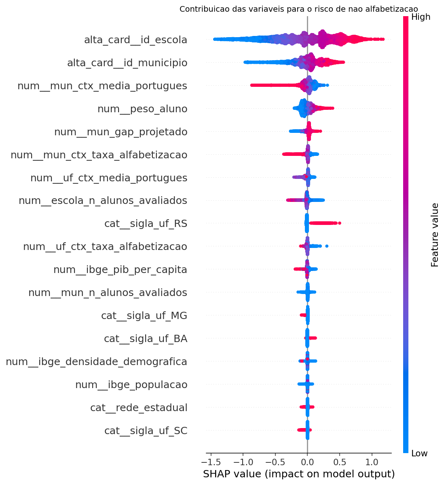

# 🎯 Predição e Inteligência Analítica para Alfabetização no Brasil

**Tech Challenge — Fase 3 (Pós-Tech FIAP · IA para Devs)**

Modelagem supervisionada sobre a camada **Gold** do Indicador Criança Alfabetizada (INEP, via
[Base dos Dados](https://basedosdados.org/dataset/073a39d4-89cf-4068-b1e8-34ed0d9c0b72)),
enriquecida com indicadores socioeconômicos da API do IBGE.

**1.851.852 alunos · 5.517 municípios · 42.328 escolas · 26 UFs**

> **Projeto autossuficiente.** A camada Gold vem embarcada em `data/gold/` — um clone limpo
> reproduz toda a análise sem depender de nenhuma fonte externa. Os dados foram produzidos
> pela pipeline medalhão da **Fase 2** deste Tech Challenge (Bronze → Silver → Gold sobre a
> Base dos Dados/BigQuery); a Fase 3 acrescentou duas visões que faltavam. A cadeia completa
> está em [`data/gold/PROVENIENCIA.md`](data/gold/PROVENIENCIA.md).

---

## 1. Contexto do problema

O **Compromisso Nacional Criança Alfabetizada** define uma meta mensurável: toda criança
brasileira alfabetizada até o fim do 2º ano do ensino fundamental, até 2030. A régua é o
**Indicador Criança Alfabetizada** — o percentual de estudantes que atingem **743 pontos**
na escala Saeb, corte estabelecido pela Pesquisa Alfabetiza Brasil de 2023.

A Fase 2 deste projeto entregou a pipeline de dados que consolida esse indicador. Mas um
número consolidado descreve o passado. Gestores públicos precisam **antecipar**: identificar
quais redes não chegarão à meta enquanto ainda há tempo de agir, e entender quais fatores
pesam de fato no resultado.

É o que esta fase constrói.

## 2. Objetivo analítico

Prever se um aluno será considerado **alfabetizado ou não alfabetizado**, usando variáveis
educacionais, territoriais e socioeconômicas — e transformar essa capacidade preditiva em
priorização acionável de política pública.

O projeto entrega **dois modelos**, e a razão para isso é um resultado da própria análise:

| Modelo | Grão | Alvo | Para quê |
|---|---|---|---|
| **Por aluno** | aluno avaliado em 2024 | não alfabetizado | responde ao enunciado; mede o quanto o contexto explica o risco individual |
| **De risco municipal** | (município, rede) | não atingir a meta de 2024 | responde às perguntas de negócio: onde alocar recurso |

A EDA mostrou que os microdados públicos **não trazem atributos individuais** — não há renda
familiar, frequência, escolaridade dos pais ou trajetória escolar. O modelo por aluno,
portanto, tem teto baixo por construção. O sinal que existe é territorial, e é no grão
territorial que ele vira decisão.

## 3. Base utilizada

A modelagem consome **exclusivamente a camada Gold**, embarcada em `data/gold/` e processada
por `src/data/build_base.py` em **DuckDB**, lendo os Parquet direto do disco.

| Visão Gold | Grão | Linhas | Origem |
|---|---|---|---|
| `gold_aluno_analitico` | (ano, id_aluno) | 3.354.661 | **Fase 3** |
| `gold_alfabetizacao_municipio` | (ano, município, rede) | 23.995 | Fase 2 |
| `gold_metas_municipio` | (município, rede) | 12.650 | **Fase 3** |
| `gold_alfabetizacao_uf` | (ano, UF) | 49 | Fase 2 |

Proveniência completa — dataset de origem, cadeia de processamento e como regenerar:
**[`data/gold/PROVENIENCIA.md`](data/gold/PROVENIENCIA.md)**.

### De onde sai cada bloco de variáveis

| Bloco | Colunas | Visão Gold |
|---|---|---|
| Avaliação do aluno | `rede`, `serie`, `caderno`, `peso_aluno` | `gold_aluno_analitico` |
| Território | `sigla_uf`, `regiao`, `id_municipio`, `id_escola` | `gold_aluno_analitico` |
| Contexto municipal **2023** | taxa de alfabetização, média de português | `gold_alfabetizacao_municipio` |
| Metas | `mun_meta_2024`, `mun_gap_projetado` | `gold_metas_municipio` |
| Contexto estadual **2023** | taxa, média de português, ranking nacional | `gold_alfabetizacao_uf` |
| Porte da rede | alunos e escolas avaliados | contagens sobre `gold_aluno_analitico` |
| Socioeconômico | população, PIB per capita, densidade demográfica | API de agregados do IBGE |

Esquema completo, papel de cada coluna e ressalvas: **[`reports/dicionario_dados.md`](reports/dicionario_dados.md)**.

### Por que a Fase 3 precisou estender a Gold

As duas primeiras visões da tabela acima vieram prontas da Fase 2. As outras duas —
`gold_aluno_analitico` e `gold_metas_municipio` — são publicadas por
`src/data/build_gold.py`, porque a Gold da Fase 2 não preservava o que esta fase exige:

**O grão de aluno não existia na Gold.** A visão `gold_desempenho_alunos` é agregada por
município/rede/série: **12.923 linhas para 3,3 milhões de alunos**, sem coluna `id_aluno`. O
alvo pedido pelo enunciado — "este aluno será alfabetizado?" — é individual.

**As metas defasadas não sobreviviam à Gold.** `gold_alfabetizacao_municipio` guarda apenas
`meta_ano`, e ela está **nula nas 11.547 linhas de 2023** — justamente o ano de contexto do
desenho anti-vazamento. As colunas `meta_alfabetizacao_2024..2030` ficaram na Silver.

A Fase 3 **estende** a camada em vez de furá-la: publica as duas visões que faltavam e passa
a ler só da Gold. Nada do que a Fase 2 entregou foi alterado. A regra é verificada
automaticamente por `bash run.sh camada`, que falha se qualquer módulo de modelagem voltar a
ler a Silver — só `build_gold.py` (que a transforma) e `verifica_premissas.py` (que valida a
matéria-prima antes da Gold existir) têm essa licença.

O recorte é aplicado ao publicar a Gold: apenas registros de `origem = 'batch'` entram — os
eventos `streaming` da Fase 2 são sintéticos, de demonstração da pipeline.

## 4. Etapas de modelagem

### 4.1 O tratamento de data leakage

Foi a decisão mais consequente do projeto, e foi tomada em três camadas.

**Camada 1 — exclusão por definição.** O alvo é `alfabetizado := proficiencia >= 743`, uma
regra determinística verificada em 1,85 milhão de registros sem uma única exceção. A
proficiência e todos os agregados que a resumem no mesmo ano (taxa municipal, média de
português de 2024) ficam fora: não são preditores, são o resultado.

**Camada 2 — defasagem temporal.** O aluno é de 2024; todo o contexto municipal e estadual
é de **2023**. Isso replica o uso real: em janeiro de 2025 o gestor dispõe dos números de
2023 e precisa decidir antes da avaliação seguinte.

**Camada 3 — vetos por diagnóstico.** A defasagem não bastou. A Fase 2 agregou algumas
colunas por município **sem o ano**, então elas têm o mesmo valor em 2023 e 2024 — e podem
carregar informação do ano-alvo. O teste aplicado: uma coluna estática só é aceitável se sua
relação com o futuro for **mediada pelo passado**, isto é `corr(X, taxa_2024) ≤ corr(X, taxa_2023)`.
A persistência da própria taxa (0,620) serve de régua.

| Coluna | corr. 2023 | corr. 2024 | Veredito |
|---|---|---|---|
| `nivel_alfabetizacao` | 0,834 | **0,856** | vetada — recalibrada com o resultado de 2024 |
| `percentual_participacao` | 0,248 | **0,363** | vetada — participação registrada na coleta de 2024 |
| `meta_alfabetizacao_2024` | 0,937 | 0,606 | mantida — mediada pelo passado |
| `meta_alfabetizacao_2030` | — | — | vetada — constante em 80,0 |

`nivel_alfabetizacao` era, com folga, a variável mais importante nas primeiras rodadas.
Removê-la custou **0,001 de PR-AUC**: ela já era 83% redundante com a taxa de 2023, e o
excedente era vazamento. Os vetos estão registrados em `src.config.COLUNAS_VETADAS_DIAGNOSTICO`,
cada um com sua justificativa.

**E, dentro do pipeline:** o `TargetEncoder` do scikit-learn faz *cross-fitting* interno — a
codificação de cada linha é estimada em folds que não a contêm, de modo que o alvo da própria
linha nunca influencia sua própria feature.

### 4.2 A pipeline

Um único objeto `Pipeline`, com todo o pré-processamento acoplado ao estimador. Não existe
etapa manual entre o dado bruto e a predição — o que garante que as estatísticas de ajuste
venham só do treino de cada fold, e o que torna o artefato implantável sem reescrita.

```
Pipeline
├── ColumnTransformer
│   ├── numéricas (16)      SimpleImputer(median, add_indicator=True) [+ StandardScaler no linear]
│   ├── categóricas (5)     SimpleImputer(most_frequent) + OneHotEncoder(handle_unknown="ignore")
│   └── alta cardinalidade  TargetEncoder(cv=5)   ← id_municipio, id_escola
└── HistGradientBoostingClassifier(class_weight="balanced")
```

`add_indicator=True` é uma decisão de conteúdo, não de conveniência: a falta de contexto de
2023 marca redes recém-integradas ao programa (São Paulo não participou daquele ciclo), e
essa ausência é informativa.

### 4.3 Validação

Dois regimes de holdout, que respondem a perguntas diferentes:

- **Holdout aleatório (20%)** — "alunos novos numa rede que já conheço".
- **Holdout agrupado por município** (`StratifiedGroupKFold`) — nenhum município aparece nos
  dois lados: "um município sem histórico".

A diferença entre os dois é a medida honesta de quanto o modelo depende do histórico local.
Busca de hiperparâmetros por `RandomizedSearchCV` (12 candidatos, CV 3-fold,
`scoring="average_precision"`), semente fixa em `src/config.py`.

## 5. Escolha do algoritmo

Quatro famílias comparadas por validação cruzada, todas com `class_weight="balanced"` para
que a comparação fosse entre famílias, não entre políticas de desbalanceamento:

| Modelo | PR-AUC (CV) |
|---|---|
| baseline (classe majoritária) | 0,4007 |
| regressão logística | 0,5632 |
| **HistGradientBoosting** ✅ | **0,5652** |
| LightGBM | 0,5651 |

Os dois boostings ficam separados por **0,0001** — literalmente dentro do ruído — e a
regressão logística fica a 0,002 deles. Numa execução anterior, com outra amostra, o LightGBM
ganhou pela mesma margem irrelevante. Essa instabilidade é o resultado, não um defeito da
comparação: as features são quase todas agregados territoriais, cuja relação com o risco
individual é suave e praticamente monotônica. Não há interações complexas a capturar porque
não há variáveis individuais — o modelo flexível não tem o que explorar além do que a reta
já pega.

**A escolha do algoritmo não é o gargalo deste problema. Os dados disponíveis são.**

Hiperparâmetros selecionados: `learning_rate=0.03`, `max_iter=400`, `max_leaf_nodes=31`,
`min_samples_leaf=20`, `l2_regularization=0.0` (PR-AUC 0,5661 na validação cruzada).

## 6. Métricas de avaliação

Métrica principal: **PR-AUC** sobre a classe "não alfabetizado". Acurácia seria enganosa
numa base 60/40 com sinal moderado, e a classe de interesse é a minoritária.

### Modelo por aluno

| Métrica | Holdout aleatório | Holdout por município |
|---|---|---|
| **PR-AUC** | **0,5899** | 0,5456 |
| ROC-AUC | 0,6986 | 0,6698 |
| F1 | 0,5982 | 0,5567 |
| Recall (em risco) | 0,6710 | 0,6007 |
| Brier | 0,2201 | 0,2347 |
| PR-AUC do acaso | 0,4017 | — |

**1,47× melhor que o acaso.** Prever um município sem histórico custa **−7,5% de PR-AUC** —
o modelo depende do histórico local, e essa dependência agora está medida em vez de suposta.

### Modelo de risco municipal

| Métrica | Holdout |
|---|---|
| **PR-AUC** | **0,8401** |
| ROC-AUC | 0,8613 |
| F1 | 0,7521 |
| Recall (redes em risco) | 0,7578 |
| Brier | 0,1521 |
| PR-AUC do acaso | 0,4645 |

**1,81× melhor que o acaso** — bem acima do modelo por aluno, porque na agregação os erros
individuais se cancelam e sobra o sinal territorial, que é justamente o que as variáveis
disponíveis medem.

### O teste anti-vazamento

Prova por contradição: com `proficiencia` reintroduzida, o modelo atinge **ROC-AUC = 1,0000**.
Um classificador perfeito que não aprendeu nada sobre alfabetização — apenas redescobriu o
limiar de 743 pontos que já define o alvo. É exatamente o modelo que um projeto descuidado
entregaria: métricas impecáveis e zero utilidade, porque a variável só existe depois que a
avaliação aconteceu, quando já não há o que prevenir.

## 7. Interpretação dos resultados

Por `permutation_importance` (queda de PR-AUC ao embaralhar) e valores **SHAP**:

### Modelo por aluno — o sinal é hierárquico, e a escola está no topo

| Variável | Queda de PR-AUC | \|SHAP\| médio |
|---|---|---|
| `id_escola` | **+0,0723** | 0,408 |
| `id_municipio` | +0,0130 | 0,166 |
| `mun_ctx_media_portugues` | +0,0027 | 0,070 |
| `sigla_uf` | +0,0021 | — |
| `mun_ctx_taxa_alfabetizacao` | +0,0020 | 0,032 |

A ordem é nítida e as duas técnicas concordam: a escola pesa **cinco vezes** mais que o
município, que pesa **seis vezes** mais que a média municipal de português — e **trinta e
cinco vezes** mais que o estado. Quanto mais granular a unidade territorial, mais ela
explica: a variação de desempenho entre escolas do mesmo município é maior que a variação
entre municípios.

Isso não é vazamento: o `TargetEncoder` de `id_escola` é ajustado por cross-fitting, então a
codificação de cada aluno nunca vem do próprio alvo. O que ele captura é o **efeito-escola**.

E é isso que explica a queda no holdout agrupado: quando um município inteiro fica fora do
treino, `id_escola` e `id_municipio` são categorias inéditas e o encoder as manda para o
prior global. O modelo perde sua variável mais forte e cai de 0,590 para 0,546. **A diferença
entre os dois holdouts é o efeito-escola, medido.**

> `peso_aluno` aparece alto no SHAP (0,068, 4º lugar). Não é característica da criança — é o
> peso amostral do desenho da avaliação, que varia por estrato, e funciona como proxy fraco
> de contexto.

### Modelo municipal — o estado decide

`sigla_uf` domina, com queda de 0,290 de PR-AUC, mais que o dobro da segunda colocada
(`meta_2024`, 0,139). Dois municípios com a mesma taxa em 2023 e a mesma meta têm chances
muito diferentes de chegar lá, dependendo da UF.

Os dois modelos, juntos, dizem algo coerente: **na escala do aluno, manda a escola; na escala
do atingimento de meta, manda o estado.** O município fica no meio dos dois.



## 8. Insights encontrados

**1. Onde a criança estuda pesa mais do que tudo o que se registra sobre ela.**
A não alfabetização vai de **64,0% na Bahia a 14,7% no Ceará** — 49 pontos percentuais de
amplitude entre UFs, contra 14 pontos entre as cinco regiões. Pelo Cramér's V, `sigla_uf`
(0,232) associa-se ao alvo dez vezes mais que a rede de ensino (0,024) e vinte vezes mais
que o caderno de prova (0,012). Duas crianças na mesma escola são indistinguíveis para o
modelo, mas uma se alfabetiza e a outra não.

**2. E dentro do estado, a escola pesa mais que o município.**
No modelo por aluno, `id_escola` é cinco vezes mais importante que `id_municipio` e quase
trinta e cinco vezes mais que `sigla_uf`. Duas leituras convivem sem se contradizer: entre estados
a desigualdade é a maior em amplitude, mas **a unidade onde o risco se concentra é a escola**.
Política pública desenhada só no nível municipal perde essa variação.

**3. O desenho das metas inverte o sinal de risco.**
`meta_2024` é a segunda variável mais importante do modelo municipal, e a razão é
estrutural: a exigência da meta é **inversamente proporcional ao patamar de partida**
(Spearman −0,913). Quem estava pior em 2023 recebeu uma meta proporcionalmente mais fácil.

O efeito no atingimento é o oposto do que a intuição sugere:

| Decil da taxa de 2023 | Taxa 2023 | Meta 2024 | Exigência | Não atingiu |
|---|---|---|---|---|
| 1 (piores) | 25,4% | 33,7% | +8,3 pp | **42%** |
| 5 | 59,0% | 62,1% | +3,1 pp | 44% |
| 9 | 82,4% | 78,8% | −3,5 pp | **57%** |
| 10 (melhores) | 93,3% | 79,0% | −14,3 pp | 35% |

Os municípios em pior situação educacional **falham menos** que os de bom desempenho, porque
suas metas são mais modestas. Isso tem uma consequência prática direta: *"não atingiu a meta"
não é sinônimo de "está mal"*, e usar o atingimento como critério de repasse ou avaliação
premia quem partiu de um patamar baixo. Se a meta é instrumento de gestão, precisa ser
alcançável; se é aspiração, não deveria servir de critério de avaliação.

**4. O Rio Grande do Sul cai 19,6 pontos percentuais em um ciclo.**
É a única UF com queda expressiva: das outras 23, a pior é o Paraná com −1,8 pp e a melhor
é Minas Gerais com +11,9 pp. A queda do RS é uniforme
entre as redes estadual e municipal, com cobertura estável (mesmos municípios, escolas e
volume de alunos). A proficiência média vai de 748,5 para 735,6 e cruza o corte de 743, o que
amplifica o efeito. **Recomenda-se confirmar com o INEP** se houve mudança de instrumento ou
de aplicação antes de qualquer decisão baseada nesses números.

**5. Quatro padrões de trajetória, que não coincidem com as cinco regiões geográficas.**
UFs de regiões diferentes compartilham comportamento e UFs vizinhas divergem:

| Padrão | UFs | Taxa 2023 | Avanço |
|---|---|---|---|
| base baixa, avanço consistente | AL, AP, BA, PA, RJ, RN, SE, TO | 41,9% | +4,6 pp |
| patamar intermediário, avanço estável | AM, ES, GO, MA, MG, MS, MT, PB, PE, PI, PR, RO, SC, SP | 62,5% | +4,5 pp |
| já no patamar da meta | CE | 89,8% | +0,4 pp |
| retrocesso | RS | 73,8% | −19,6 pp |

**6. Metade das redes não chega a 2030 no ritmo atual.**
Extrapolando linearmente o avanço de 2023→2024, **50,2%** das 10.806 redes atingem os 80% em
2030. É um dimensionamento de esforço, não uma previsão — com dois pontos no tempo, qualquer
modelo mais elaborado seria falsa precisão.

**7. A priorização pelo modelo supera a heurística do gestor — que é pior que o acaso.**
Ordenar pela pior taxa do ano anterior é o que se faria com uma planilha. Entre as 250 redes
priorizadas no holdout, o modelo acerta **93%** contra **38%** da heurística. E nas 100
primeiras a heurística acerta apenas **25%**, **abaixo dos 46% de uma escolha aleatória** —
consequência direta do insight 3: as redes com pior taxa receberam as metas mais fáceis.

Priorizar pelos piores números não é só subótimo; leva ativamente ao lugar errado.

## 9. Limitações

- **Sem atributos individuais.** Os microdados públicos não trazem renda familiar,
  frequência, escolaridade dos pais, defasagem idade-série ou infraestrutura escolar. É a
  limitação que define o teto do modelo por aluno e a razão de a entrega ser a priorização
  territorial.
- **Dois ciclos de avaliação** (2023 e 2024). Toda projeção para 2030 é uma reta entre dois
  pontos e não captura aceleração, desaceleração ou reversão.
- **A anomalia do RS** distorce o peso de `sigla_uf` e ainda não tem explicação verificada.
  No topo do ranking de risco, o modelo está em boa medida reproduzindo o efeito estadual.
- **Cobertura desigual entre anos.** São Paulo não participou de 2023; o contexto defasado
  falta para ~2% dos alunos, tratado por imputação com indicador de ausência.
- **O modelo descreve, não explica.** As associações não estabelecem causalidade: priorizar
  uma rede porque o modelo a aponta é gestão de risco, não diagnóstico pedagógico.
- **Recursos de execução.** O ambiente disponível (WSL, 2 vCPUs, ~3 GB de RAM) levou a
  treinar sobre uma amostra de 600 mil das 1,85 milhão de linhas. A curva de aprendizado
  **não foi medida**, então não dá para afirmar que a base completa não traria ganho — é a
  primeira coisa a testar com mais recursos. O que se observa é que passar de ~100 mil
  linhas de treino (na validação cruzada) para 480 mil rendeu cerca de +0,02 de PR-AUC.

## 10. Aplicação prática para políticas públicas

1. **Priorizar por probabilidade, não por taxa.** `reports/municipios_risco.csv` traz as
   10.806 redes ordenadas por risco previsto, com faixa e partição explícitas. A alternativa
   real não é o acaso — é a ordenação pela pior taxa do ano anterior, e o modelo a supera
   por larga margem.
2. **Não usar o atingimento da meta como medida de qualidade.** A exigência da meta é
   inversamente proporcional ao patamar de partida (−0,913), então "não atingiu" mede sobretudo
   quanto se pediu, não quanto se entregou. Para avaliação e repasse, o indicador honesto é o
   **avanço em pontos percentuais**, não o atingimento binário.
3. **Agir em dois níveis, não em um.** O peso de `sigla_uf` no modelo municipal indica que a
   política estadual — formação de professores, material, regime de colaboração — explica
   mais variação de atingimento do que decisões municipais isoladas. Já no risco individual,
   quem manda é a **escola**: é ali que a intervenção pedagógica precisa chegar.
4. **Escolher o limiar como decisão de política.** O corte de probabilidade define quantas
   crianças entram no programa de reforço. O notebook 02 entrega a fronteira
   precisão × revocação ao gestor em vez de esconder a escolha atrás de um 0,5 arbitrário.
5. **Investigar o Rio Grande do Sul** antes de agir sobre esses números.

## 11. Possíveis evoluções

- **Integrar o Censo Escolar** (infraestrutura, formação docente, distorção idade-série) e o
  **Cadastro Único** — é o caminho mais curto para elevar o teto do modelo por aluno, que
  hoje é limitado pela ausência de variáveis individuais.
- **Acrescentar ciclos** conforme o INEP publica, substituindo a extrapolação linear por
  modelagem de série temporal com efeitos por UF.
- **Modelo hierárquico** (aluno dentro de escola dentro de município dentro de UF), que
  representa explicitamente a estrutura aninhada que o `TargetEncoder` só aproxima.
- **Monitoramento de drift** sobre o pipeline salvo, comparando a distribuição de entrada
  de cada novo ciclo com a do treino.
- **Painel de priorização** consumindo `municipios_risco.csv`, com filtro por UF e faixa.

---

## Como executar

**Pré-requisito: nenhum dado externo.** A camada Gold vem embarcada em `data/gold/` (~40 MB,
versionada), então um clone limpo roda do zero. Só é preciso Python 3.12+ e conexão para o
`setup` e para o enriquecimento do IBGE, que fica em cache na primeira execução.

Os **modelos já vêm treinados** em `models/`, então dá para inspecionar os resultados sem
esperar a hora de treino. Para só reproduzir a análise, bastam dois comandos:

```bash
bash run.sh setup      # instala o uv, cria o venv e as dependências
bash run.sh base       # reconstrói a base analítica a partir da Gold embarcada (~2 min)
bash run.sh notebooks  # executa os três notebooks de ponta a ponta            (~10 min)
```

Para refazer o treino do zero:

```bash
bash run.sh camada     # verifica que a modelagem só consome a Gold
bash run.sh aluno      # treina o modelo supervisionado por aluno   (~1 h)
bash run.sh municipio  # treina o modelo de risco municipal         (~2 min)

bash run.sh all        # encadeia tudo
```

### O que é versionado e o que é regenerado

| | Onde | Tamanho | Origem |
|---|---|---|---|
| **Camada Gold** | `data/gold/` | 40 MB | versionada — é o insumo do projeto |
| **Modelos treinados** | `models/*.joblib` | 3,7 MB | versionados — prontos para uso |
| Amostra da base | `data/processed/*_amostra.parquet` | 1,6 MB | versionada |
| Código, notebooks, relatórios | `src/`, `notebooks/`, `reports/` | ~6 MB | versionados |
| Base analítica completa | `data/processed/` | 31 MB | `run.sh base` |
| Cache do IBGE | `data/external/` | 182 KB | baixado na primeira execução |

Total do repositório: **~50 MB**.

> **Os modelos versionados exigem as versões de `requirements.txt`** — em especial
> `scikit-learn==1.5.2`. O formato de serialização do scikit-learn muda entre versões, e
> carregar um pipeline com outra pode falhar ou, pior, funcionar com comportamento alterado.
> O `bash run.sh setup` instala exatamente as versões pinadas.

### Etapas opcionais — só com o data lake da Fase 2

`premissas` e `gold` regeneram a camada Gold a partir da Silver da fase anterior. **Sem o
data lake por perto, elas se autopulam com uma mensagem explicativa** — é por isso que
`run.sh all` funciona num clone limpo.

```bash
export FASE3_DATA_LAKE=/caminho/para/Tech_Challenge/data_lake
bash run.sh premissas   # revalida a matéria-prima da Silver
bash run.sh gold        # regenera gold_aluno_analitico e gold_metas_municipio
```

O venv fica em `~/.venvs/fase3`, no filesystem do Linux — o projeto vive sob o OneDrive,
onde milhares de arquivos de venv seriam lentos e entrariam na sincronização.

> **Nota de ambiente.** O LightGBM exige `libgomp.so.1`, que normalmente viria de
> `apt install libgomp1`. Onde não há `sudo`, `run.sh` resolve apontando o loader para a
> cópia que o wheel do scikit-learn já distribui.

> **Nota sobre nomes de arquivo.** Os Parquet da Gold usam nomes curtos (`data_0.parquet`)
> em vez dos nomes longos que o Spark gera (`part-00000-f7bcd831-…-c000.snappy.parquet`).
> Não é cosmético: com o caminho profundo deste repositório, aqueles nomes chegavam a 276
> caracteres e o Git no Windows recusava indexá-los com `Filename too long` — o limite
> MAX_PATH é 260. Se você mover o projeto para um caminho ainda mais longo e esbarrar nisso,
> `git config core.longpaths true` resolve.

## Estrutura

```
Tech_Challenge_Fase_3/
├── README.md  requirements.txt  run.sh
├── data/
│   ├── gold/         ⭐ camada Gold embarcada — o insumo do projeto
│   │   └── PROVENIENCIA.md     de onde vieram os dados
│   ├── external/     cache da API do IBGE
│   └── processed/    base analítica (+ amostra versionada)
├── models/           ⭐ pipelines .joblib treinados, prontos para uso
├── notebooks/
│   ├── 01_eda.ipynb                análise exploratória e hipóteses
│   ├── 02_modelagem_aluno.ipynb    auditoria do modelo por aluno
│   └── 03_risco_municipal.ipynb    priorização e perguntas de negócio
├── src/
│   ├── config.py                   caminhos, semente, contrato de colunas e vetos
│   ├── data/       verifica_premissas · build_gold · verifica_camada · build_base · ibge
│   ├── features/   build_features (ColumnTransformer)
│   ├── models/     train_aluno · train_municipio
│   └── viz/        plots (paleta validada para daltonismo)
└── reports/
    ├── images/                 figuras da EDA e da modelagem
    ├── dicionario_dados.md     esquema completo e ressalvas
    ├── municipios_risco.csv    ranking de priorização
    └── metricas_*.json         métricas e importâncias
```

⭐ marca o que torna o projeto autossuficiente: a camada Gold e os modelos treinados vêm no
repositório. A única coisa que falta num clone limpo é a base analítica derivada (~31 MB),
reconstruída em cerca de dois minutos por `bash run.sh base`.

## Reprodutibilidade

Semente única em `src/config.py`. O notebook 02 recarrega o pipeline salvo num processo novo,
refaz a carga e o split com a mesma semente e **verifica que a métrica do holdout bate com a
registrada no treino** — com `assert`, não por inspeção visual.

Esse `assert` já se pagou. Na primeira execução ele **falhou**, e o motivo não era óbvio: o
`USING SAMPLE ... (reservoir, seed)` do DuckDB **não é determinístico** sob leitura paralela.
Duas chamadas com a mesma semente devolveram amostras com apenas **22% de sobreposição**, o
que tornava o holdout irreproduzível mesmo com toda a semeadura do scikit-learn correta.

A correção foi trocar a amostragem por uma função do identificador —
`ORDER BY hash(id_aluno || seed) LIMIT n` para a carga de treino e
`WHERE hash(id_aluno || seed) % 1000000 < limiar` para a amostra versionada. O resultado
depende só do dado e da semente, nunca do plano de execução.

A lição vale além deste projeto: **semear o modelo não basta se a amostragem dos dados não
for determinística**, e sem um teste que compare as métricas entre processos isso passa
despercebido.
